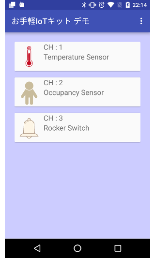
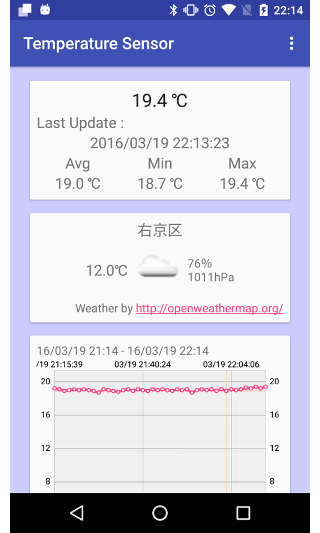

お手軽IoTキット Androidデモアプリケーション
=================

お手軽IoTキットのAndroidデモアプリケーションです。  

お手軽IoTキットはサイミックス株式会社から発売中の
センサー、Arduinoゲートウェイおよびクラウドアカウントがセットになった、気軽にIoTを始められるセットです。  
ゲートウェイとセンサーとの接続済みのため、ゲートウェイの電源を入れLANケーブルにつなぐだけで
直ぐさまセンサーデータがクラウドにあがります。
[お手軽IoT公式サイト](https://easyiot.tumblr.com/)

このアプリケーションは、クラウドのデータをAndroid端末上で確認するためのデモアプリケーションです。  
ビルド済みのアプリケーションを[**Google Play**](https://play.google.com/store/apps/details?id=com.kubotaku.android.sample.sensordataviewer)で公開しています。  
キット入手後、APIトークンをアプリケーションで入力することで、すぐに動作を確認することができます。

Image
-----------------------------------

Usage
-----------------------------------

アプリケーションのメニューから「Set API Token」を選択して、ScalenicsのAPIトークンを設定します。

またオプションでOpenWeatherMapのAPIを利用して指定地点の天候情報を取得できます。  
OpenWeatherMapのAPIの利用にあたっては、登録が必要です（無料）。

License
-----------------------------------
      Copyright 2016 kubotaku1119 <kubotaku1119@gmail.com>
      
      Licensed under the Apache License, Version 2.0 (the "License");
      you may not use this file except in compliance with the License.
      You may obtain a copy of the License at
      
        http://www.apache.org/licenses/LICENSE-2.0
        
      Unless required by applicable law or agreed to in writing, software
      distributed under the License is distributed on an "AS IS" BASIS,
      WITHOUT WARRANTIES OR CONDITIONS OF ANY KIND, either express or implied.
      See the License for the specific language governing permissions and
      limitations under the License.
